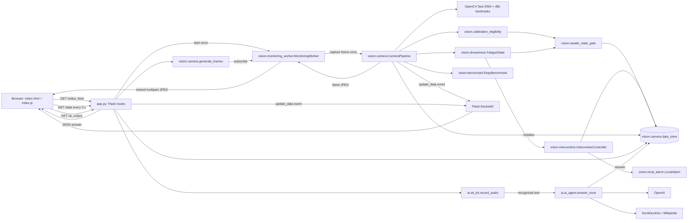

# EEPY Architecture

This document describes the repository as it exists today. It is a map for future
contributors and coding agents, not a claim that every roadmap component has already
been built. Where the current prototype differs from the intended edge-device
architecture, that difference is called out explicitly.

## System intent and safety boundary

EEPY is an edge-first driver-fatigue monitor. The laptop webcam, microphone, and
speakers currently stand in for dedicated in-vehicle hardware. The safety-critical
path is intended to be local and deterministic:

```text
camera -> facial measurements -> fatigue state -> local intervention
```

All four stages now exist locally. Confirmed fatigue produces the video/dashboard warning
and immediately requests a non-blocking, locally synthesised speaker alarm. A deterministic
controller tracks numbered episodes, repeat cooldowns, escalation level, and observed
recovery. The separate voice assistant still depends on online services and is initiated
by the user; it is not connected to fatigue confirmation.

`docs/roadmap.md` is the source of truth for planned changes. Calibration Steps 1A and
1B now provide per-frame technical-quality classification and rolling awake-state
eligibility, but personal profile generation and calibrated fatigue scoring do not. One
application-owned camera/inference worker now runs independently of HTTP stream clients.
An explicit `MonitoringSession` and non-blocking assistant remain planned.

## Repository map

```text
.
├── app.py                         Flask/Socket.IO composition root and HTTP routes
├── vision/
│   ├── camera.py                  Camera ownership, face inference, metrics, streaming
│   ├── calibration_eligibility.py Per-frame calibration quality classification
│   ├── awake_state_gate.py        Rolling awake-state calibration eligibility
│   ├── drowsiness.py              Deterministic, time-based fatigue state machine
│   ├── intervention.py            Fatigue episodes, cooldowns, and escalation
│   ├── local_alarm.py             Offline non-blocking speaker alarm adapter
│   ├── monitoring_worker.py       Single camera owner and latest-frame publisher
│   └── benchmark.py               Optional in-memory latency/FPS instrumentation
├── ai/
│   ├── ai_agent.py                LangChain 1.x/OpenAI agent lifecycle
│   ├── tools.py                   DuckDuckGo and Wikipedia agent tools
│   └── stt_tts.py                 Microphone STT and ElevenLabs/pygame TTS adapters
├── templates/
│   ├── index.html                 Live camera/metrics/assistant page
│   └── home.html                  Static product information page
├── static/
│   ├── js/index.js                Socket.IO updates, polling, assistant request
│   └── css/                       Shared and page-specific presentation
├── models/
│   ├── opencv_face_detector.pbtxt TensorFlow face-detector graph definition
│   ├── opencv_face_detector_uint8.pb
│   │                                 Tracked face-detector weights
│   └── shape_predictor_68_face_landmarks.dat
│                                     Required dlib model; downloaded, gitignored
├── tests/test_drowsiness.py       Unit tests for deterministic fatigue transitions
├── tests/test_calibration_eligibility.py
│                                     Unit tests for per-frame calibration quality
├── tests/test_awake_state_gate.py     Unit tests for rolling calibration eligibility
├── tests/test_intervention.py         Unit tests for episode/controller transitions
├── tests/test_local_alarm.py          Unit tests for alarm success and fallback
├── tests/test_benchmark.py            Unit tests for intervention latency lifecycle
├── tests/test_monitoring_worker.py    Worker ownership/retry/publication unit tests
├── docs/reference/               Landmark-index diagrams and explanation
├── docs/roadmap.md               Ordered future architecture milestones
├── requirements.txt              Pinned Python dependencies
├── .env.example                  Optional online-service credentials
└── .github/workflows/deploy.yaml CI compile and unit-test workflow (despite its name)
```

`agents.md` contains contributor instructions. On case-sensitive systems its lowercase
name is distinct from the conventional `AGENTS.md` filename.

## Current component relationships



There are two mostly separate runtime paths which meet at `data_store` and the browser:

- The local vision path runs in one daemon monitoring thread owned by the application. It
  captures frames, performs inference, updates fatigue/intervention state, emits metrics,
  and publishes the newest JPEG even when no `/video_feed` client is connected.
- The `/video_feed` path only waits for a newer published sequence and yields that shared
  JPEG. It never opens the webcam or performs inference. Slow clients skip intermediate
  frames instead of accumulating a stale queue.
- The optional assistant path is loaded lazily and runs synchronously inside `/ai_output`.
  It records from the microphone, calls online speech recognition and an OpenAI-backed
  agent (which may call web tools), stores the answer, and returns JSON. Import, speech,
  tool, and model failures return HTTP 503 without preventing local monitoring startup.

No assistant function is called by the fatigue engine. `output_audio()` exists for the
standalone command-line assistant loop in `ai/ai_agent.py`, but the Flask `/ai_output`
route does not call it.

## Startup and object lifetime

`app.py` is the web application composition root. Importing it imports
`vision.camera`, which immediately:

1. creates the process-wide `SocketIO` object;
2. loads the OpenCV face detector from the two tracked model files;
3. creates dlib's frontal-face detector; and
4. loads the gitignored 68-landmark predictor.

These are import-time side effects, so missing model files, an unexpected working
directory, or incompatible native libraries prevent the Flask app from importing. Model
paths are relative to the process working directory, not to `camera.py`.

`app.py` then attaches the imported `SocketIO` object to the Flask app. Direct execution
starts the monitoring worker before `socketio.run(...)`; debug mode starts it only in the
Werkzeug serving child so the reloader parent does not compete for camera index `0`.
WSGI-style imports start it idempotently on the first request. An `atexit` hook requests
worker shutdown. `FLASK_DEBUG` controls debug mode and defaults off.

`app.py` deliberately does not import `ai.ai_agent` or `ai.stt_tts` at startup. The
`/ai_output` route imports them only when the optional assistant is requested, so a
missing LangChain/audio dependency, API key, or online service cannot prevent the Flask
camera application from starting.

Important lifetimes:

- `face_net`, `predictor`, `socketio`, `data_store`, and `monitoring_worker` are
  process-wide globals.
- `CameraPipeline` creates one `FatigueState`, `AwakeStateGate`,
  `InterventionController`, `LocalAlarm`, and `EepyBenchmark` when the worker thread
  starts. Their histories survive browser connections and disconnections.
- The worker owns the sole `cv2.VideoCapture(0)` handle. It releases and retries the
  handle after open/read failure and releases it on shutdown.
- The LangChain 1.x compiled agent graph is constructed on the first successful assistant
  request and cached process-wide. `answer_once()` nevertheless supplies a new empty
  message history for every request, so web requests do not form a conversation.
- The speech-recognition `Recognizer` is process-wide.

## HTTP and browser flow

| Route | Server behavior | Consumer |
|---|---|---|
| `/` | Renders `templates/index.html` | Camera dashboard |
| `/home` | Renders `templates/home.html` | Static information page |
| `/video_feed` | Subscribes to the worker's latest multipart JPEG snapshots | `` on camera page |
| `/data` | Returns a JSON snapshot of global `data_store` | Three-second polling fallback/update |
| `/ai_output` | Performs one blocking listen-and-answer operation | Dashboard button |

The dashboard receives state in two ways. `CameraPipeline` emits the Socket.IO
`update_data` event on every processed frame, while `index.js` also fetches `/data` every
three seconds. Both update the same EAR, MAR, drowsiness, and AI-response DOM elements.
Socket.IO's browser client is loaded from a CDN; polling still updates metrics if that CDN
or the socket connection is unavailable, provided the rest of the page is running.

The MJPEG stream and metric updates are related but not an atomic snapshot. JPEG encoding
happens after the shared store and socket update, so a browser can briefly display values
from a different frame than the visible image.

## Vision and fatigue pipeline

For every captured frame, the monitoring worker calls `CameraPipeline.process()` once:

1. Capture one BGR frame from webcam index `0`.
2. Convert it to grayscale for dlib landmark prediction.
3. Resize/normalise a copy into an OpenCV DNN blob and run face detection.
4. Keep the largest detection above confidence `0.5` as the presumed driver.
5. Predict 68 facial landmarks inside that rectangle.
6. Extract the two six-point eye contours and a six-point subset of the outer mouth.
7. Calculate EAR and MAR safely and estimate approximate head pose.
8. Classify calibration frame quality as valid, degraded, or rejected.
9. For computable EAR/MAR values, normalise them and update `FatigueState` independently
   of calibration frame quality.
10. Feed frame quality, raw ratios, and current fatigue state into the rolling awake gate.
11. Feed fatigue state into the intervention controller and immediately start any local
    speaker alarm action before emitting browser state.
12. Update global UI state, emit it, draw landmarks and (when drowsy) warning text.
13. JPEG-encode the annotated frame and publish it as the worker's sole latest snapshot.

The “largest face is the driver” rule is a current heuristic, not identity tracking. It
can switch between people from frame to frame. For the current single-driver prototype,
Step 1A intentionally uses that same largest-face assumption and does not reject a frame
solely because additional faces are present.

### Calibration frame quality

`vision.calibration_eligibility.py` implements Roadmap Step 1A as deterministic per-frame
technical validation. It does not determine whether the driver is awake and does not
build a personal profile. It returns a `FrameEligibility` containing a quality level and
explicit reason codes:

- `valid`: the frame meets the preferred technical-quality policy;
- `degraded`: the measurements remain plausible but conditions are non-ideal;
- `rejected`: the measurements are structurally unusable for calibration.

Missing faces, invalid boxes, malformed or non-finite landmarks, required landmarks
outside the image, collapsed feature geometry, impossible vertical landmark ordering,
invalid EAR/MAR, and extreme pose reject a frame. A relatively small face, clipped face
box with visible required landmarks, lower confidence, moderate pose, or unavailable pose
degrades it instead. Both valid and degraded frames may enter the Step 1B rolling gate;
rejected measurements may not.

Face occupancy is divided by frame width and height, visible face area is divided by the
raw detection area, and landmark spans are divided by face width. These dimensionless
ratios keep quality decisions consistent across camera resolutions. Head pose uses
OpenCV's `solvePnP` with six existing facial landmarks and a generic 3D face model, then
converts the rotation to approximate pitch, yaw, and roll in degrees. Pose failure is a
degraded condition because otherwise valid measurements should not be discarded solely
because the approximate pose model failed.

The policy boundaries are named initial engineering defaults rather than validated
production limits. They need representative camera testing. They do not change the
existing global EAR/MAR fatigue thresholds or closure timing.

### Rolling awake-state gate

`vision.awake_state_gate.AwakeStateGate` is a pure, deterministic temporal gate created
once per video stream beside `FatigueState`. It stores at most the current 10-second
window of timestamped observations. Valid awake-consistent intervals receive full time
credit, degraded intervals receive half credit, and rejected frames receive none. A
maximum credit per interval prevents sparse observations from being mistaken for
continuous evidence.

Eligibility requires 8 seconds of recent history, 6 weighted seconds of evidence, a
recent usable observation, stable EAR, no meaningful downward EAR trend, acceptable
mouth behavior, and no active recovery freeze. Brief blink-like closure withholds that
sample but preserves history. Prolonged closure, confirmed fatigue, and sustained or
repeated suspicious mouth opening quarantine the preceding 2 seconds and extend a
5-second recovery freeze. A backward or non-finite timestamp resets the temporal state.

The dashboard receives the gate decision, explicit reason codes, evidence duration,
history duration, and whether the current sample is approved. No personal baseline is
built yet; Step 2 will be the first consumer of approved samples. Gate policy boundaries
are initial conservative engineering defaults, not validated physiological constants.
The independent global fatigue detector remains active regardless of gate eligibility.

### Facial ratios

Both aspect ratios use six ordered landmarks:

```text
ratio = (distance(p1, p5) + distance(p2, p4))
        / (2 * distance(p0, p3))
```

The numerator averages two vertical openings and the denominator is the horizontal span.
This makes the measurement less sensitive to face size than raw pixel distances. EAR is
the average of the two eye ratios; MAR applies the same geometry to selected outer-lip
points. Values are rounded to three decimals. The landmark ordering and diagrams are
documented in `docs/reference/README.md`.

EAR and MAR calculation now rejects non-finite distances and a zero horizontal span. An
uncomputable ratio rejects the frame for calibration and clears current fatigue evidence
as if the face measurement were missing, rather than crashing the video generator.

### Normalisation and fixed safety constants

Raw ratios are mapped to clamped severity values:

```text
eye_closure = clamp((0.4 - EAR) / (0.4 - 0.2), 0, 1)
mouth_open  = clamp((MAR - 0.3) / (0.9 - 0.3), 0, 1)
```

An eye is considered closed when `EAR < 0.3`; a raw benchmark signal is active when that
is true or `MAR > 0.6`. These global thresholds and bounds live in `vision/camera.py`.
They are not personalised and must not be silently changed. Planned calibration may adapt
facial geometry but must retain a global fallback and must not redefine unsafe closure
duration.

### `FatigueState` transitions

`FatigueState` is deliberately independent of OpenCV, Flask, and network services. Its
caller supplies severity values and a monotonic timestamp, which makes its behavior
deterministic and unit-testable.

While the eye is closed:

```text
sustained_seconds = max(0, now - closure_started - 0.5)
eye_evidence      = eye_severity * sustained_seconds / 1.0
mouth_evidence    = average mouth severity from the last 5 seconds
combined          = 0.7 * eye_evidence + 0.3 * mouth_evidence
drowsy            = eye_closed and combined >= 0.7
```

The 0.5-second grace period filters normal blinks. After it, fully severe closure needs
one additional second to provide eye evidence of `1.0`; lower severity takes longer.
Recent mouth opening can make an active eye closure confirm sooner, but cannot confirm
fatigue by itself because `drowsy` also requires `eye_closed` and mouth weight alone is
below the `0.7` threshold.

Mouth samples are stored in a `deque` of `(timestamp, severity)` pairs. Old samples are
removed from the left because they arrive in time order; this avoids repeatedly shifting
the remaining history as a list would. The deque is time-bounded rather than size-bounded,
so its memory use still depends on frame rate.

`just_confirmed` and `just_recovered` are transition flags relative to the prior update.
Opening the eyes resets closure timing immediately. `face_missing()` clears closure time,
mouth history, and drowsiness so evidence from one visible face is not carried across a
gap to a potentially different face.

## Local intervention controller

`vision.intervention.InterventionController` is independent of OpenCV, Flask, audio, and
network services. The first `is_drowsy=True` update creates a monotonically increasing
integer episode ID, sets escalation level 1, and emits one `initial_alert` action. It does
not emit another action on every frame. Persistent fatigue emits `repeat_alert` after each
15-second cooldown and increments the escalation level. An observed non-drowsy update
emits `recovered` once and closes the episode.

An unavailable observation is represented by `None`, not `False`. This keeps an active
episode open when the face or ratio measurement disappears, because loss of observation
is not evidence of recovery. Cooldown alerts can still repeat in that state. Timestamps
must be finite and monotonic; invalid controller inputs raise rather than silently
corrupting episode timing.

`vision.local_alarm.LocalAlarm` synthesises three 880 Hz pulses as signed 16-bit PCM in
memory and prepares them as a pygame `Sound`. `Sound.play()` allocates a mixer channel and
returns immediately, so the vision loop does not wait for the tone to finish. The alarm
is attempted before Socket.IO emission and does not import or call the optional assistant.
If mixer initialisation or playback fails, the error is exposed in monitoring state and
the existing local video warning plus dashboard alert remain active. The terminal bell is
also attempted as a last resort, but it is not considered successful alarm delivery.

## Shared state and concurrency

`vision.camera.data_store` is the current cross-component state container:

```python
{
    "EAR": 0,
    "MAR": 0,
    "is_drowsy": False,
    "calibration_frame_quality": "rejected",
    "calibration_frame_reasons": ["no_face"],
    "calibration_awake_eligible": False,
    "calibration_awake_reasons": ["insufficient_history"],
    "calibration_evidence_seconds": 0.0,
    "calibration_history_seconds": 0.0,
    "calibration_sample_approved": False,
    "intervention_active": False,
    "intervention_episode_id": None,
    "intervention_escalation_level": 0,
    "intervention_action": None,
    "intervention_message": "",
    "local_alarm_available": False,
    "local_alarm_error": None,
    "camera_running": False,
    "camera_error": None,
    "ai_response": "",
}
```

The vision generator mutates the measurement, fatigue, calibration, and intervention
fields. `/ai_output` mutates `ai_response`. `/data` and socket emissions read shallow
copies or the dictionary itself.
There is no lock, session object, ownership protocol, or per-field timestamp.

Consequences of the current design:

- Multiple browser connections now share one camera, inference pipeline, state history,
  and latest JPEG inside a process. A slow consumer observes the newest sequence rather
  than forcing the worker to queue or reprocess older frames.
- Disconnecting every stream client no longer stops capture, inference, or intervention.
- The worker is idempotent within one process, but multiple server processes would still
  create independent workers and compete for camera index `0`. EEPY remains a one-process
  edge application.
- Depending on the server's threading/worker configuration, assistant and vision updates
  can interleave. Individual dictionary operations are not a coherent multi-field snapshot.
- The blocking microphone/network assistant request can occupy a request worker
  indefinitely because listening and HTTP calls currently have no explicit timeouts.

The next roadmap step replaces the remaining global dictionary with a thread-safe
`MonitoringSession`. Do not introduce distributed state merely to work around this
prototype; the target remains one active driver/device session.

## Optional assistant path

Pressing “Get AI Output” starts this synchronous chain:

```text
browser -> /ai_output
        -> SpeechRecognition microphone capture
        -> Google speech recognition
        -> cached LangChain 1.x compiled agent
        -> ChatOpenAI (gpt-4o-mini)
        -> optional DuckDuckGo/Wikipedia tools
        -> Pydantic ResearchResponse parsing
        -> data_store + Socket.IO + JSON response
```

`initialise_agent()` requires `OPENAI_API_KEY`. It uses LangChain 1.x `create_agent` with
`ResearchResponse(topic, summary)` as its structured response schema. LangChain selects
the supported structured-output strategy and returns the validated Pydantic object in the
agent state's `structured_response` field; EEPY returns its `summary`. DuckDuckGo and
Wikipedia are exposed as typed Python tool functions. This whole branch is optional,
internet-dependent enhancement behavior.

`ai/stt_tts.py` also provides ElevenLabs speech synthesis and local playback through
pygame. It requires `ELEVENLABS_API_KEY`, writes a temporary MP3, plays it synchronously,
and attempts to delete it. This is used by the standalone wake-word loop, not the Flask
route. Failures generally print and return `False`; there is no deterministic local spoken
fallback in that optional assistant path. Fatigue alerts use the separate offline alarm.

## Benchmarking and tests

Setting `EEPY_BENCHMARK_ENABLED` to a truthy value enables one `EepyBenchmark` in the
worker-owned pipeline. `EEPY_BENCHMARK_FRAME_COUNT` controls when it prints a one-time summary (default
500 frames). It records processing latency, complete frame-loop latency, FPS, raw-signal
to confirmation, and confirmation to successful local alarm delivery. Failed speaker
attempts are not counted as delivery.

`tests/test_drowsiness.py` covers the pure state machine: blink grace, severity-dependent
timing, mouth corroboration, one-shot transitions, recovery, and missing-face reset. It
does not currently test ratio calculations, normalisation, camera/model integration,
Flask routes, assistant behavior, shared-state concurrency, or benchmark calculations.
`tests/test_calibration_eligibility.py` covers valid, degraded, and rejected frame
classification; resolution-invariant geometry; low but finite EAR; missing and malformed
measurements; clipping; relative face size; landmark visibility/order; and pose policy.
Head-pose estimation itself still requires camera-level integration testing.

`tests/test_awake_state_gate.py` covers startup withholding, time-weighted valid and
degraded evidence, tolerated and excessive gaps, EAR instability and downward trend,
blink-like recovery, prolonged closure, stable low EAR, confirmed fatigue, sustained and
repeated suspicious mouth behavior, quarantine/freeze behavior, and timestamp reset.

`tests/test_intervention.py` covers initial and repeat actions, cooldown boundaries,
escalation, recovery, episode IDs, missing observations, timestamp validation, and policy
validation. `tests/test_local_alarm.py` covers mixer setup, non-blocking playback success,
unavailable channels, initialisation failure, and contained playback exceptions without
requiring physical audio hardware.

`tests/test_benchmark.py` verifies successful local delivery timing and ensures an episode
that recovers after failed audio does not prevent the next episode being benchmarked.

`tests/test_monitoring_worker.py` uses injected fake capture and processing adapters to
cover idempotent startup, one capture owner, latest-frame replacement, shared consumer
snapshots, camera-open retry, processing-error containment, multipart output, and clean
capture release without requiring webcam hardware.

CI installs native camera/audio dependencies, compiles Python files, and runs unittest
discovery on Python 3.13. It does not start the camera pipeline and therefore does not
require the downloaded landmark model during tests.

## Failure and fallback behavior

| Failure | Current behavior | Safety implication |
|---|---|---|
| Landmark model absent or model path wrong | App import fails | Monitoring never starts |
| Webcam cannot open/read | Worker exposes the error, releases the handle, and retries every second | Monitoring remains alive but cannot detect new fatigue until capture recovers |
| No face detected | Fatigue history clears and `is_drowsy` becomes false; an already-active intervention episode stays open | Recovery is not falsely inferred, but loss of driver visibility has no separate alert |
| No face after prior measurements | EAR/MAR remain at their previous values, while rejected-frame, fatigue, and intervention state is emitted | Ratios can look stale, but absence does not falsely close an active intervention episode |
| Landmark prediction/encoding error | Worker exposes the error, drops that frame, and continues | A transient failure loses one observation rather than terminating monitoring |
| Local mixer cannot initialise or allocate a channel | Error is exposed; terminal bell is attempted; visual warning remains active | Audible delivery is not guaranteed and is not counted by the benchmark |
| Socket.IO/CDN unavailable | Three-second `/data` polling still updates the page | Video and detection can continue, but UI is delayed |
| Speech not recognised | `/ai_output` returns a fixed apology | Vision is logically independent, subject to server resource contention |
| Assistant import, speech, OpenAI, tool, or network error | `/ai_output` logs the failure and returns HTTP 503; local monitoring continues | Must never be used for the initial local warning |
| ElevenLabs/playback error | Logs error and returns false | Unrelated to the local fatigue alarm |

## Safe extension points and dependency direction

Future changes should preserve this dependency direction:

```text
hardware adapters (camera/audio)
        -> pure measurements and fatigue/calibration logic
        -> explicit monitoring/session state
        -> deterministic intervention controller
        -> presentation adapters (Flask/dashboard)

optional network assistant -> consumes events/state, never gates the chain above
```

In practical terms:

- Keep deterministic fatigue, calibration, and intervention decisions free of Flask,
  Socket.IO, OpenAI, and speech-recognition imports.
- Preserve the worker's single application-owned camera lifecycle and latest-frame
  publication boundary; HTTP clients must remain consumers rather than owners.
- Prefer latest-frame semantics over a backlog, because stale inference is unsafe and adds
  latency.
- Put calibration, metrics, episode state, intervention state, and assistant state behind
  one explicit session owner before adding more global fields.
- Deliver an immediate local alert before scheduling any optional online assistant work.
- Add deterministic tests whenever a state transition or safety rule is introduced.

Follow `docs/roadmap.md` in order only when the corresponding step is explicitly requested;
this architecture map does not authorize implementing later milestones automatically.
